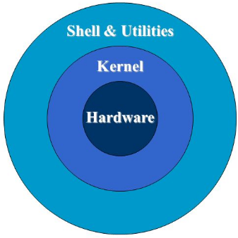

<p align="center">
  <h1 align="center">Bash Programming: Introduction to Unix Components</h1>

## UNIX: A Machine Independent Operating System

### Unix Philosophy
- Emphasis on creating simple, modular tools.
- Each tool performs a specific function effectively.
- Tools can be combined to perform complex tasks.

### Prototyping and Efficiency
- Focus on developing working prototypes and improving them incrementally.
- Encourages brevity in commands and messages to minimize typing and output.

## Unix Kernel: The System's Core

### Functionality
- Manages resources, process scheduling, data transfer, command execution, and file access permissions.

### Machine Independence
- Written in C, ensuring compatibility across different hardware.
<p align="center"><a href="#"></a></p>

## Overview of Unix Shells 
 
### Shell Scripts and Shells
- The shell interprets and executes user commands, passed to the OS kernel.

### Terminal
- Interface for user interaction with the shell.

### Variety of Shells
- Bourne shell (sh), C and TC shell (csh, tcsh), Bourne Again shell (Bash), Korn shell (ksh), Z shell (zsh).

## Setup and Shell Discovery

### Finding Your Shell
- List available shells:
```
ls /bin/*sh
````

### Default Shell
- Check default shell:
```
echo $SHELL
```

### Bash Version
- Determine Bash version:
```
bash --version
```

## Why Command Line?

### Beyond GUI Limitations
- Command-line use is not restricted by GUI limitations.

### Stability and Advanced Scripting
- CLI tools often offer greater stability and scripting capabilities for complex, automated tasks.

## Why Learn Bash?

### Foundational Knowledge
- Bash provides a foundational understanding of scripting in Unix-like systems.

### Widespread Use
- Bash and sh are among the most commonly used scripting languages on Unix systems.

### Open Source
- Bash is open source, allowing for community-driven development and use.

## Expectations for Today's Session

### Today's Focus
- Introduction to basic features of bash scripting.

### Learning Outcomes
- Working with files and directories using command line.
- Understanding and using pipes and filters.
- Grasping the semantics of loops and conditional statements.
- Working with integer arithmetic expressions.
- Basics of writing shell scripts.
