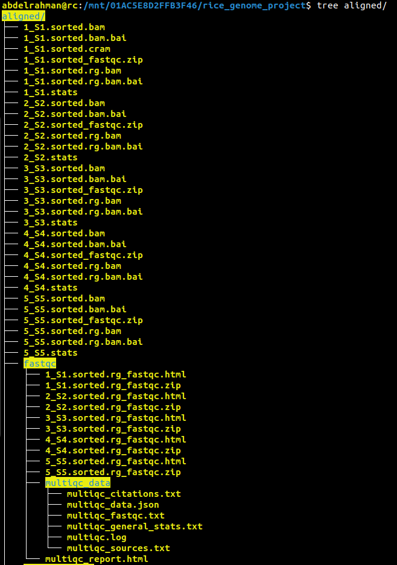
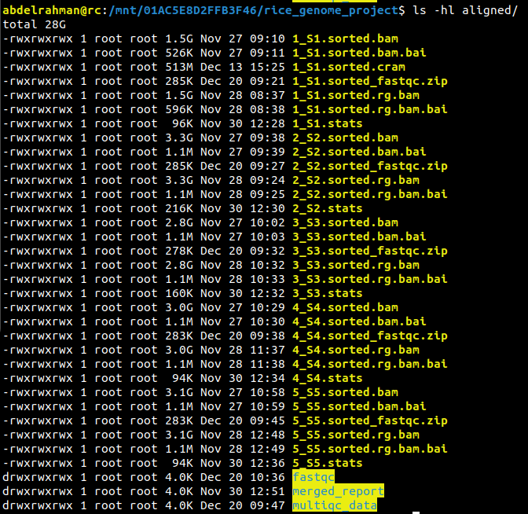
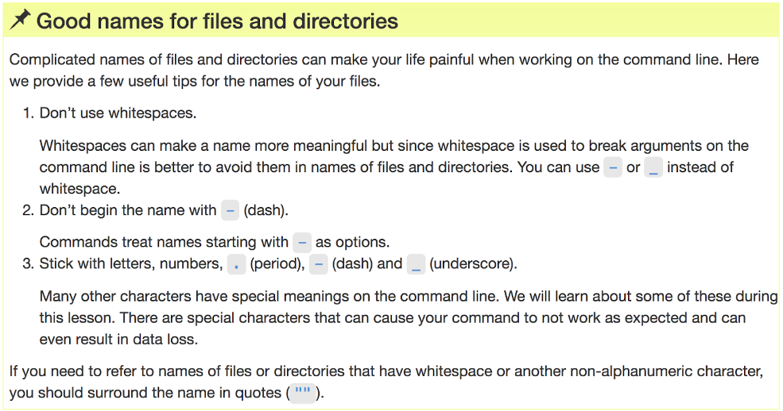
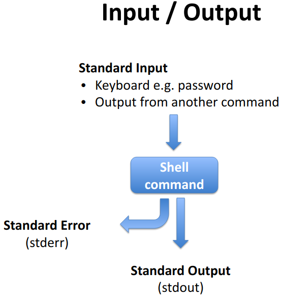

# Essentials of Bash Scripting

## File and Directory Navigation Commands

```bash
# Display current directory
pwd

# Change to root directory
cd /

# Change to user's home directory
cd ~

# Move up one directory level
cd ..

# Move up two directory levels
cd ../..

# Stay in the current directory
cd .

# Navigate to a specific directory
cd /users/nelle/Desktop/data-shell

# List files and directories
ls
````
## Visualizing Directory Structures
### Install tree command for visual representation
```
sudo apt-get install tree
```
### Display directory tree structure
```
tree
```
<p align="center"><a href="#"></a></p>

<h2 align="left">More details about your files</h2>
<p align="center"><a href="#"></a></p>


<h2 align="left">Make your life easier</h2>
<p align="center"><a href="#"></a></p>

## Advanced File Manipulation
### Create new directories
```
mkdir thesis lectures
```
### Open a file in nano editor
```
nano draft.txt  # Save with CTRL-O 
```
### Rename and move directories and files
```
mv lectures manuscript
mv manuscript thesis/.
mv draft.txt final.txt
mv final.txt thesis/.
mv thesis/final.txt draft.txt
```
### Copy files
```
cp draft.txt thesis/
cp draft.txt thesis/2ndCopy.txt
```
### Remove files and directories
```
rm thesis
rm -r thesis
rm draft.txt
```
<p align="center"><a href="#"></a></p>

## Advanced File Handling: Pipes and Filters
### Navigate to a specific directory
```
cd molecules
```
### Count words, lines, characters in files
```
wc *.pdb
```
### Redirect output to a file
```
wc -l *.pdb > lengths.txt
```
### Display file contents
```
cat lengths.txt
```
### Sort and save output
```
sort -n lengths.txt
sort -n lengths.txt > sorted-lengths.txt
```
### Display the first line of a sorted file
```
head -n 1 sorted-lengths.txt
```
### Chain commands with pipes
```
sort -n lengths.txt | head -n 1
wc -l *.pdb | sort -n | head -n 1
```
### Return to the previous directory
```
cd ../
```
### Count lines in a text file
```
wc -l notes.txt
```
### Count lines without filename
```
wc -l < notes.txt
```

## Exploring Command Differences
### Writing to files
```
echo hello > testfile01.txt
echo hello >> testfile02.txt
```
### Using uniq and sort commands
```
uniq data/salmon.txt
sort data/salmon.txt | uniq
```
### Counting occurrences
```
uniq -c data/salmon.txt
sort data/salmon.txt | uniq -c
```
