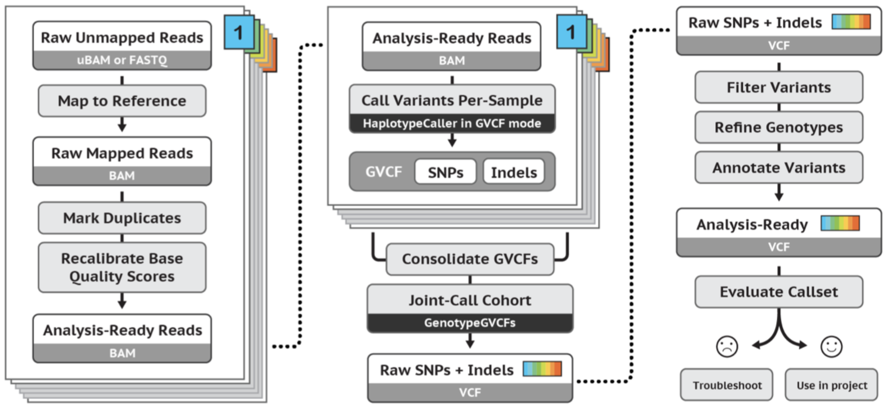

# DAY 2, Practical Part. 
This tutorial explains how to use the GATK best practices guidelines for WGS data, which can be found [here](https://gatk.broadinstitute.org/hc/en-us/articles/360035535932-Germline-short-variant-discovery-SNPs-Indels-) for GATK usage and [here](https://gatk.broadinstitute.org/hc/en-us/articles/360035535912-Data-pre-processing-for-variant-discovery) for data preprocessing. It is solely intended for educational reasons. This Tutorial was copied and edited from [Ibra Lujumba](https://hackmd.io/@harbi811).m

<p align="center"><a href="#"></a></p>

## Part [1]: Docker Installation and Image start
**All tools needed was downloaded and installed on a docker image for anyone to be able to reproduce the same data without errors**
### 1.1 Download Docker
#### 1. Update the apt package index and install packages to allow apt to use a repository over HTTPS:
```
sudo apt-get update && \
sudo apt-get install \
    ca-certificates \
    curl \
    gnupg \
    lsb-release
```    
#### 2.Add Docker’s official GPG key:
```
sudo mkdir -p /etc/apt/keyrings && \
curl -fsSL https://download.docker.com/linux/ubuntu/gpg | sudo gpg --dearmor -o /etc/apt/keyrings/docker.gpg
```
#### 3.Use the following command to set up the repository:
```
echo \
  "deb [arch=$(dpkg --print-architecture) signed-by=/etc/apt/keyrings/docker.gpg] https://download.docker.com/linux/ubuntu \
  $(lsb_release -cs) stable" | sudo tee /etc/apt/sources.list.d/docker.list > /dev/null
```
### 1.2 Install Docker Engine
#### 1.Update the apt package index:
```
sudo apt-get update
```
#### 2.Install Docker Engine, containerd, and Docker Compose. 
```
sudo apt-get install docker-ce docker-ce-cli containerd.io docker-compose-plugin
```
#### 3.Verify that the Docker Engine installation is successful by running the hello-world image:
```
sudo docker run hello-world
```
### 1.3 Install our tutorial docker image
```
sudo docker pull mahmoudbassyouni/wgs_workshop_marc:1.0.2
```
### 1.4 Run the docker image
```
sudo docker run -it -v $HOME:/data/ mahmoudbassyouni/wgs_workshop_marc:1.0.2
```
## Part [2]: Dataset Retrieval and Pre-Proccessing
### 2.1 Dataset Download
**Pick some data from SRA database using sratools**
Create a text file and paste in these accession numbers. Call it `accession.txt`
```
ERR10219899
ERR10219901
```
**How to do it using bash command line ?** 
*hint use 'echo' with the separator being \n*.
#### 1. Download our data
```
mkdir fastqs

for sample in `cat accession.txt`;
do
    fastq-dump --split-files  $sample -O fastqs/
    
done
```
#### 2. Quality Check
**Let’s check the quality. Create a folder fastqc_htmls**
```
mkdir fastqc_htmls

fastqc fastqs/* --outdir fastqc_htmls

cd fastqc_htmls

multiqc .
```
**How many reads are contained in each file?**
#### 3. Trimming
```
mkdir trimmed_reads

for sample in `cat accession.txt`;
do
    R1=fastqs/"${sample}"_1.fastq
    R2=fastqs/"${sample}"_2.fastq

    java -jar /opt/Trimmomatic-0.39/trimmomatic-0.39.jar PE -threads 4 -phred33 \
    $R1 $R2 \
    trimmed_reads/"${sample}"_1_paired.fastq trimmed_reads/"${sample}"_1_unpaired.fastq \
    trimmed_reads/"${sample}"_2_paired.fastq trimmed_reads/"${sample}"_2_unpaired.fastq \
    LEADING:10 TRAILING:10 SLIDINGWINDOW:4:15 MINLEN:36
done
```
**Run a second quality check to confirm that the reads meet the trimming specifications specified**
* Compare reports before and after trimming.
* Compare file sizes before and after trimming
## Part [3] : Alignment
### 3.1 Download our reference genome for chromosome 13 from Ensembl
```
wget https://ftp.ensembl.org/pub/current_fasta/homo_sapiens/dna/Homo_sapiens.GRCh38.dna.chromosome.13.fa.gz
```
#### 1. Index using samtools and bwa
The reference genome should be in the same directory as its index
```
gunzip Homo_sapiens.GRCh38.dna.chromosome.13.fa.gz

bwa index Homo_sapiens.GRCh38.dna.chromosome.13.fa

samtools faidx Homo_sapiens.GRCh38.dna.chromosome.13.fa
```
### 3.2 Alignment using bwa-mem
```
for sample in `cat accession.txt`;
do
    R1=trimmed_reads/"${sample}"_1_paired.fastq
    R2=trimmed_reads/"${sample}"_2_paired.fastq
    
    bwa mem -aM -t 4  \
        Homo_sapiens.GRCh38.dna.chromosome.13.fa \
        -R "@RG\tID:${sample}\tSM:${sample}\tPL:ILLUMINA" \
            $R1 $R2 > "${sample}".sam
            
    # convert to BAM format
    samtools  view -Shb "${sample}".sam > "${sample}".bam
    
    # all this can be run using one command
    # bwa mem -aM -t 4 Homo_sapiens.GRCh38.dna.chromosome.13.fa -R "@RG\tID:${sample}\tSM:${sample}\tPL:ILLUMINA" \
     #      $R1 $R2 | samtools view -Shb - > "${sample}.bam"
done
```
#### 1. Sorting and indexing BAM files
```
for sample in `cat accession.txt`;
do
    samtools sort "${sample}".bam -o "${sample}"_sorted.bam
    
    samtools index "${sample}"_sorted.bam
    
done
```
## Part [4] : Using GATK
While following GATK best practices guidelines, the following steps are necessary. These steps are computationally intensivee
1. Marking duplicates
2. Base recalibration
3. HaplotypeCaller

Before using GATK, we shall create an index of the reference genome. This should also be located in the same directory as the reference genome
```
gatk CreateSequenceDictionary --REFERENCE Homo_sapiens.GRCh38.dna.chromosome.13.fa --OUTPUT Homo_sapiens.GRCh38.dna.chromosome.13.dict
```


**Make directories `metrics` and `gatk`**
### 3.1 Download a reference set of known variants
```
mkdir metrics gatk

wget https://ftp.ensembl.org/pub/current_variation/vcf/homo_sapiens/homo_sapiens-chr13.vcf.gz

gunzip homo_sapiens-chr13.vcf.gz
```
### 3.2 Index the VCF
```
gatk IndexFeatureFile -I homo_sapiens-chr13.vcf
```
**Copy this and save is as `gatk.sh`. It may take a while to run this so it can be run in the background**.

To do this:
```
nohup bash gatk.sh >& gatk.log &
```
```
#!/bin/bash
set -x
set -e

reference_genome="/data/Documents/Homo_sapiens.GRCh38.dna.chromosome.13.fa"
known_vcf="/data/Documents/homo_sapiens-chr13.vcf"

# Check if reference genome and known VCF exist
if [[ ! -f "$reference_genome" || ! -f "$known_vcf" ]]; then
    echo "Reference genome or known VCF file not found."
    exit 1
fi

while IFS= read -r sample; do
    input_bam="/data/Documents/${sample}_sorted.bam"  # Adjust the path as necessary

    # Check if input BAM file exists
    if [[ ! -f "$input_bam" ]]; then
        echo "BAM file for sample ${sample} not found."
        continue
    fi

echo "Marking Duplicates Start"

    # marking duplicates

    gatk MarkDuplicates \
              --INPUT $input_bam \
              --OUTPUT gatk/"${sample}"_sorted_dedup.bam \
              --METRICS_FILE metrics/"${sample}"_dup_metrics.txt \
              --REMOVE_DUPLICATES true \
              --CREATE_INDEX true

echo "BQSR Start"

    # BQSR building the model

    gatk BaseRecalibrator \
            --input gatk/"${sample}"_sorted_dedup.bam \
            --output gatk/"${sample}"_recal_data.table \
            --reference "${reference_genome}"  \
            --known-sites "${known_vcf}"

echo "Recailbration Start"
    # Applying BQSR Recalibration

    gatk ApplyBQSR \
           --bqsr-recal-file gatk/"${sample}"_recal_data.table \
           --input gatk/"${sample}"_sorted_dedup.bam \
           --output gatk/"${sample}"_sorted_dedup_BQSR_recal.bam \
           --reference "${reference_genome}"

echo "Haplotype Caller Start"

    gatk HaplotypeCaller \
           --reference "${reference_genome}" \
           --input gatk/"${sample}"_sorted_dedup_BQSR_recal.bam \
           --output gatk/"${sample}".vcf.gz \
	   --native-pair-hmm-threads 16

done < "/data/Documents/accession.txt"
```
